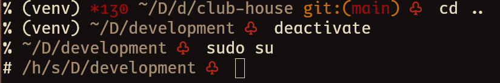

# Club House

## Description

A theme for the ZSH shell that its decorated by a cards club symbol.



> **Note**
> The theme may look different in your setup as its appearance depends of what
> colors and font you are using for your terminal emulator. Use the preview as
> just a reference.

Here is the description of its design:
-	A decorator will tell your user privileges: it will be `%` if you are a
	normal user or `#`, if you are `root`.
-	Virtual environments that you have sourced will appear inside parenthesis.
	For example: `(venv)`.
-	If your last command failed, its exit code will appear prefixed by `*`. For
	example: `*130`.
-	Your current directory will appear abbreviated: for parent directories, only
	their initials will be used.
-	If inside a Git repository, the current branch will appear inside
	parenthesis and prefixed by `git:`. For example: `git:(main)`.

## Installation

### Dependencies

The following dependencies must be installed to run this software:

| Dependency | Description |
|-|-|
| `git` | Required to retrive information about Git repositories. |
| A [Nerd Fonts](https://github.com/ryanoasis/nerd-fonts/releases)' font | Provides the required pretty symbols. |

### Manual Procedures

Use the following instructions to install this theme manually.

-	Run the following command inside of a terminal emulator to install the theme.
```bash
git clone --depth=1 https://github.com/skippyr/club-house\
                    ~/.local/share/zsh/themes/club-house &&
printf "%s%s\n" "source \"~/.local/share/zsh/themes/club-house/"\
       "club-house.zsh-theme\"" >> ~/.zshrc
```

-	Reopen the terminal emulator to load the theme.

### Procedures With OhMyZSH

Use the following instructions to install this theme for OhMyZSH.

-	Run the following command inside of a terminal emulator to install the theme.

```bash
git clone --depth=1 https://github.com/skippyr/club-house\
                    ${ZSH_CUSTOM:-${HOME}/.oh-my-zsh/custom}/themes/club-house
```

-	Change the value of the `ZSH_THEME` variable in your ZSH configuration file,
	`~/.zshrc`, to use the theme:

```bash
ZSH_THEME=club-house/club-house
```

-	Reopen your terminal emulator to load the theme.

## Support

Report issues, questions and suggestion through the [issues tab](https://github.com/skippyr/club-house).

## Copyright

This software is distributed under the MIT License. A copy of the license is
bundled with the source code.

Copyright (c) 2023, Sherman Rofeman. MIT license.
